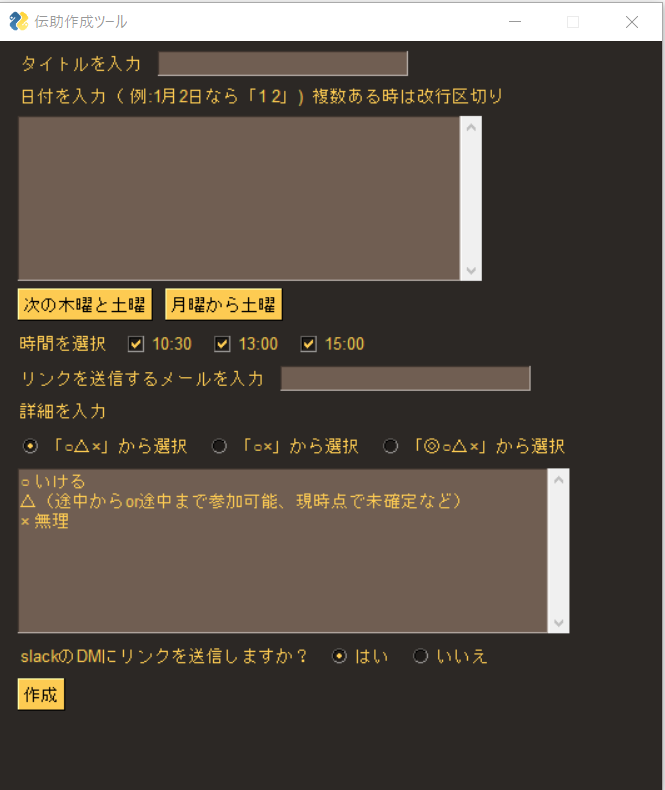
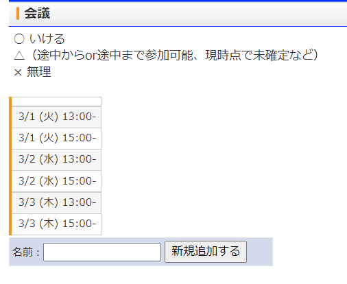

# densuke_guiについて
これはスケジュール調整サービス「伝助」の日時入力をより簡単にし、また作成された伝助のページへのリンクをslackに送信するモジュールです。  
お使いの際は時間の設定やメールアドレスなど、個人でお好みに編集してください。
# 使用上の注意
このモジュールではブラウザ操作を自動化するライブラリである「Selenium」を使用しています。しかし、伝助のサイトにはこのような自動化が良いとも悪いとも記載されていないため、使用する際はあくまで自己責任でお願いいたします。  
また、インポートしているライブラリでインストールしていないものがあれば使用する前に各個人で適宜インストールしてください。
# 使い方
実行すると次のような画面が表示されるはずです。
  
タイトルに「会議」と入力し、
日付を入力するフィールドに例えば

>3 1  
3 2  
3 3

と入力、そして「時間を選択」のチェックボックスには13:00と15:00の二つにチェックを入れて作成ボタンを押すとブラウザが立ち上がり次のような伝助のページが作成されます。  
  

# 便利な機能
「次の木曜と土曜」ボタンを押すと日付の入力欄が更新され次の木曜日と土曜日が表示されます。（「なんで木曜と土曜なの？」と思われる方もいらっしゃるかもしれませんが、これは私がよくこのツールを木曜と土曜の場合に使うことが多かったからです....）  
同様に「月曜から土曜」ボタンを押すと日付の入力欄が更新され次の月曜から土曜までの日時が改行区切りで与えられます。

また、スクリプトの
```python:
WEB_HOOK_URL =""
```
のところにこのツールを用いて作成したリンクを送信したいslackのWebhook URLを入力していただくと、「slackのDMにリンクを送信しますか？」という項目に「はい」と答えた場合に限って指定されたslackのチャンネルにリンクが送信されます。  
(チャンネルのWebhook URLを指定すればいいのでそれがDMである必要はないのですが、私がこのツールを使うときは自分のDM宛てに送信することを想定して作ったのでこのような表記になっています。)  
<span style="color: red">もしメールアドレス欄に何も入力せず、かつこのslack送信機能も使わないのであればせっかく作成した伝助のページへのリンクを取得する術がなくなってしまうので十分注意してください。（つまりどちらかには値を入力して使ってください。）</span>  
# 使用例
使用している様子を映したgifを貼り付けます。
この例では"月曜から土曜"ボタンと"「◎○△×」から選択"ボタンを使用して、次の月曜から土曜までの日にちでそれぞれ10:30、13:00、15:00の時刻が選択できるようにしています。  
 
